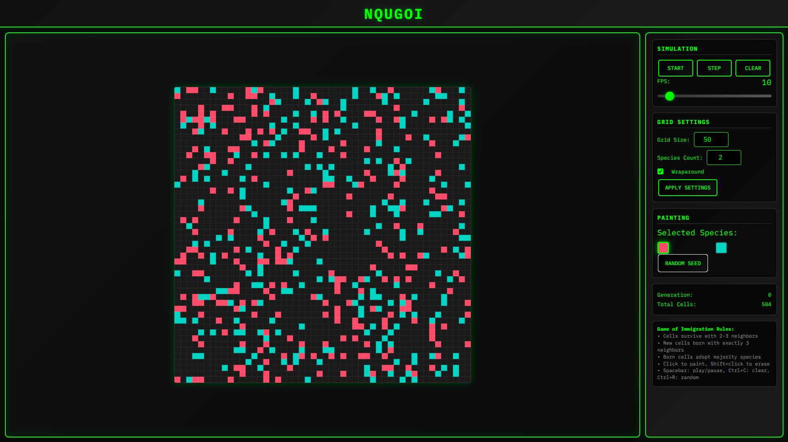

# nqugoi

A cellular automata simulation inspired by Conway's Game of Life but with _species diversity and interaction rules_ based on immigration dynamics


## Features

- Multiple species
- Interactive grid: paint or erase cells
- Adjustable FPS and grid size
- Wraparound toggle
- Keyboard controls for quick actions
- Responsive and performant rendering

## Tech Stack

- Typescript
- Vite (Dev server & bundler)
- HTML Canvas API

## Setup

```bash
git clone https://github.com/neuroquarkk/nqugoi.git
cd nqugoi
bun install
bun run dev
```

To build and preview:

```bash
bun run build
bun run preview
```

## Controls

- **Mouse:**
    - Click -> paint cell
    - Shift + click -> erase cell
- **Keyboard:**
    - `Space` -> toggle play/pause
    - `Ctrl + c` -> clear grid
    - `Ctrl + r` -> randomize

---

**Hope you enjoy playing with it**
